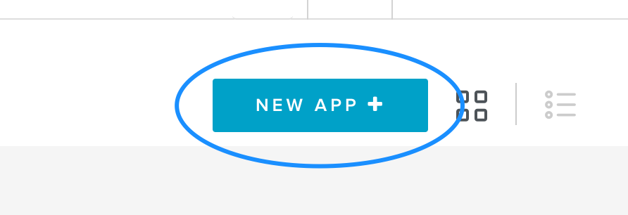
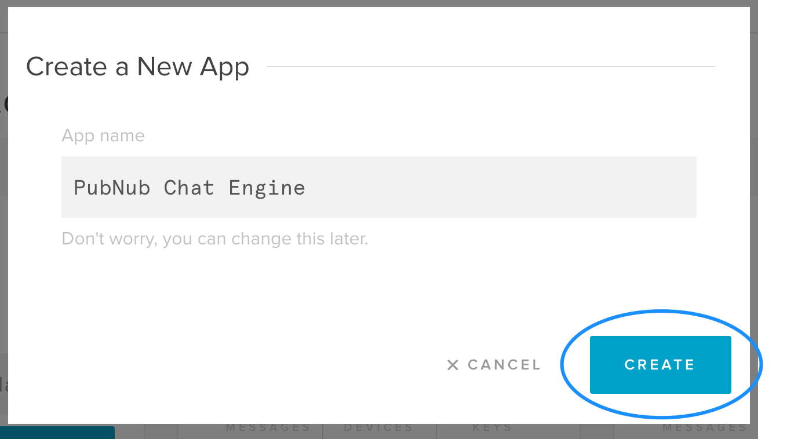
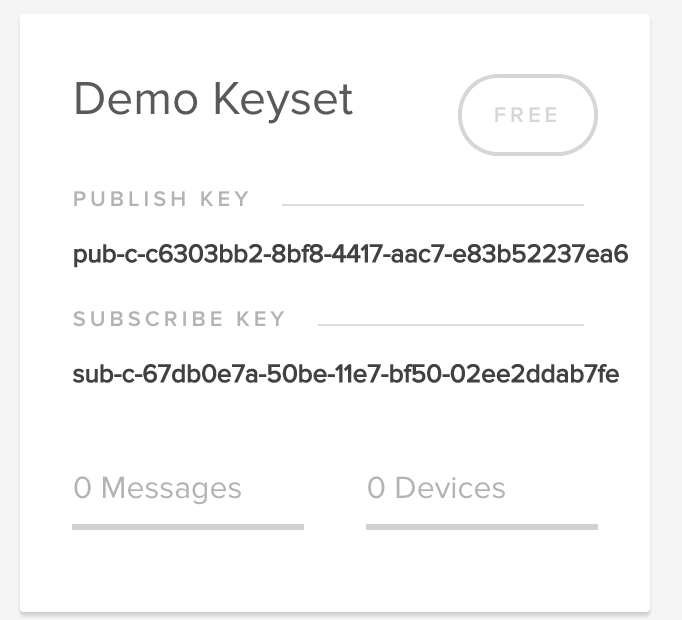
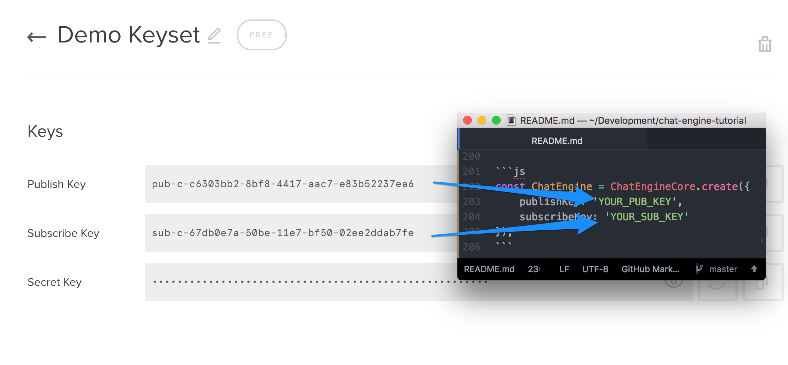
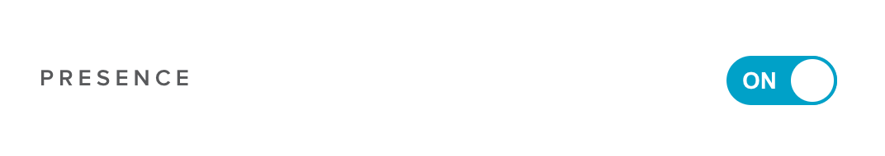
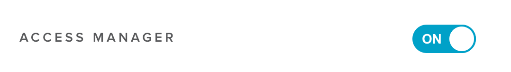
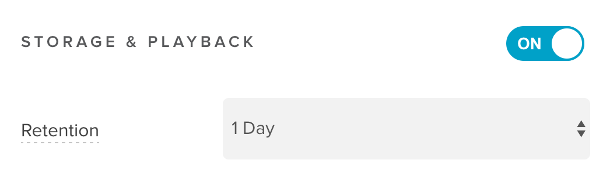
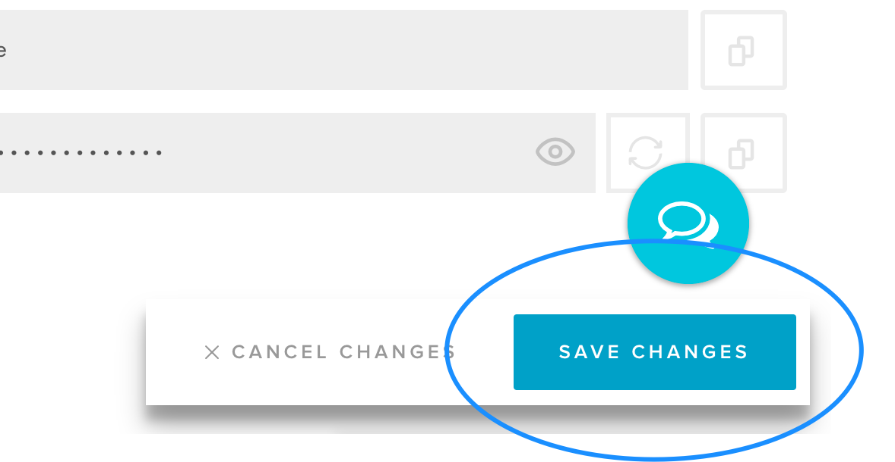

## How to Get Your PubNub Keys

Navigate to http://admin.pubnub.com and login or create an account. Don't worry, it's free!

https://admin.pubnub.com

Click "New App."



Give your new app a name and click "Create."



Click on your keyset.



Copy and paste those keys into your ```app.js```.

```js
const ChatEngine = ChatEngineCore.create({
    publishKey: 'YOUR_PUB_KEY',
    subscribeKey: 'YOUR_SUB_KEY'
});
```




Scroll down and enable PubNub Presence.



> Not yet supported.
> Enable PubNub Access Manager.
> 

Scroll down and enable PubNub Storage and Playback. "Retention" is how long messages will be stored in chatrooms.



Click "Save Changes."


